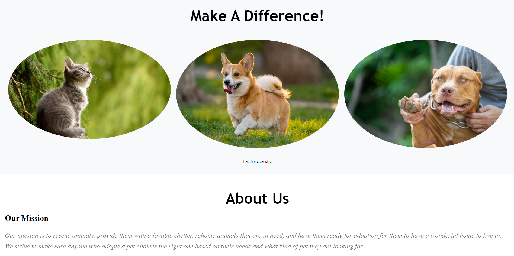

# Shelter the Wild



## Description
Welcome to Shelter the Wild! Here we rescue animals and look after them so that they are ready to be in a new home for anyone who wants to adopt them! You get a chance to see what animals we have for adoption based on what your needs from an animal and fit into your life. Enjoy viewing our shelter and have a wonderful time with your new pet. Our future development will be to find more animals that need rescuing and provide a great adoption experience for every owner out there and for everyone including their pets to live a happy life!

## Link
https://shelter-the-wild.onrender.com

## Table of Contents
 * [Description](#description)
 * [Installation](#installation)
 * [Usage](#usage)
 * [License](#license)
 * [Contributing](#contributing)
 * [Tests](#tests)
 * [Questions](#questions)
 * [Resources](#resources)

## Installation
You will need these npm (Node Package Manager) in order to view Shelter the Wild. You will navigate to the root of the directory of the package.json file, navigate to "Open in Integrated Terminal" and enter these commands to install the packages:
```
npm install


```


## Usage
You can use the "Node.js" terminal to check out Search the Wild, and checkout information about what animals we have to offer for adoption. You will be checking out the database on MongoDB based on mongoose to view information about the animals to understand about their background. You can also use GraphQL to test out the 

## License
[](https://opensource.org/licenses/MIT)

## Contributing
All the contributions to this project is all done by Miles Wildmore, Val Spadoni, Alberto Lawrant.


## Tests

To test out Shelter the Wild, you will need to run the server by typing this in the terminal and open the localhost from the root directory with this command: 
```
npm run develop

```

If you want to leave Shelter the Wild in the terminal, hold "CTRL+C" ("CMD+C" for Mac) to stop hosting localhost.

## Resources

Link to npm page : https://www.npmjs.com/

Link to more information on MongoDB: https://www.mongodb.com/

Link to more information on MERN: https://www.mongodb.com/resources/languages/mern-stack

Link to get node.js: https://nodejs.org/

## Questions
If you would like contact me for further information, be sure to reach out to me at mileswildmore@hotmail.com

If you would like to know how to setup dependencies and more projects, check out our repos at 

https://github.com/mileswildmore18

https://github.com/ParryProgramming

https://github.com/oooweeee
 
 link to deployed site on render
 https://shelter-the-wild-o4yi.onrender.com
 
